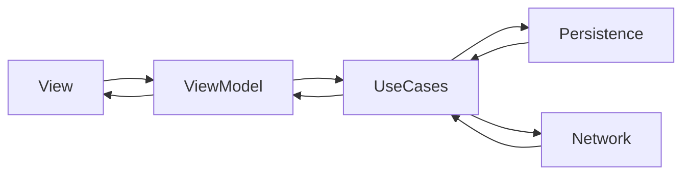

# MPA - My Principle Archive

> Use SwiftData, Swift Testing, SwiftUI before WWDC 25

일기를 쓰면 키워드를 Core ML 로 추출하여 현재 가지고 있는 원칙들을 보여준다.

## Architecture

## Features

1. 일기는 적는다. 양은 적은 것을 선호한다.
2. 일기는 Core ML 을 이용해서 키워드를 추출한다.
    - 추출한 키워드는 각 글을 열었을 때 상단에 표기한다.
    - 각 키워드를 눌렀을 때 어느 날짜의 글이 키워드 추출에 영향을 주었는지 보여준다.
3. 키워드는 메인화면에 최대 5개까지 버블 형태의 UI 로 보여준다.
    - 이것이 현재 자신의 원칙을 뜻한다.
    - 버블의 색깔은 초록색과 빨간색이 짙은 주황색을 섞는다. 초록색이 짙을수록 오래된 키워드이다.
4. 애플로그인, 구글로그인을 지원한다. 로그인은 단순히 일기 접근 권한을 확인할 뿐이다.

## Reserved Works

- 현재는 전체 일기에서 키워드를 추출하지만 특정 날짜로도 가능하도록 세분화할 예정.
- 비속어 필터링이 추가될 예정. 비속어는 서버와 동기화가 필요.
    - 이 용어들은 사용자에게 보여지길 원하지 않으므로 암호화. 앱 내에서 복호화.
- 로그인은 기능을 확장한다.
    - 키워드를 보내는 것에 동의할 경우 서버와 동기화 진행. 다른 사용자의 키워드 현황을 볼 수 있는 차트를 만들 예정.
- iOS <-> Android 간 블루투스를 통해 일기 공유가 가능하도록 할 예정.
